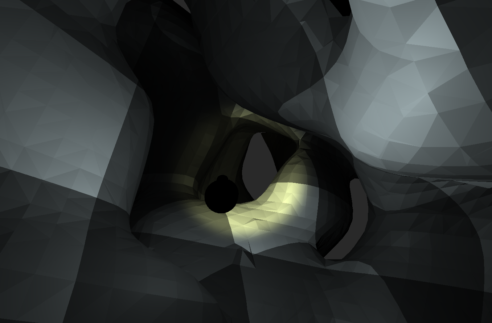

# procedual-world-generation

Infinite world generation made in Unity using the marching cubes algorithm.

---

A little game/project about procedual world generation. It can be played [here](
https://crysaac.itch.io/procedual-world-generation-using-marching-cubes):

It contains an implementation of the *Marching Cubes* algorithm, which constructs a 3D Mesh from three-dimensional scalar fields (aka 3D Arrays containing float values from 0 to 1).

The whole algorithm also runs on the GPU using compute shaders.

The project is heavily inspired by Sebastian Lagues [video](https://www.youtube.com/watch?v=M3iI2l0ltbE) on the algorithm. I highely recommend his videos.

Since this was done to learn about GPU Computing and procedual world generation, there is not much actual game content. I may expand on this in the future.

---

## Screenshots

--- 

